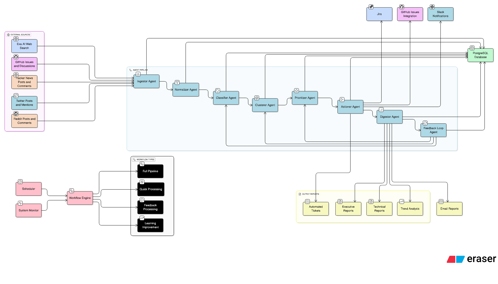

# Product Feedback Miner - Agentic AI Orchestration Pipeline

A **backend-only agentic AI orchestration pipeline** that automatically collects, processes, and prioritizes product feedback from multiple sources using specialized autonomous AI agents working in orchestrated sequence.

## 🎯 Overview

The Product Feedback Miner transforms raw feedback from multiple sources into actionable, prioritized insights through an autonomous AI agent pipeline. Each agent specializes in a specific task and works collaboratively to process feedback for **any product**.

## 🤖 AI Agent Architecture

The pipeline consists of 8 specialized AI agents that work in orchestrated sequence:

### **1. Ingestor Agent**
- **Purpose**: Autonomous data collection from external sources
- **Sources**: GitHub issues, Hacker News, Exa AI web search, Twitter, Reddit
- **Capabilities**: Rate-limited API calls, data validation, source-specific parsing
- **Output**: Raw feedback data stored in PostgreSQL database

### **2. Normalizer Agent** 
- **Purpose**: Intelligent data cleaning and standardization
- **Processes**: HTML cleaning, deduplication, language detection, PII scrubbing, word count filtering
- **Capabilities**: Batch processing, quality scoring, content normalization
- **Output**: Clean, standardized documents ready for AI analysis

### **3. Classifier Agent**
- **Purpose**: AI-powered feedback categorization using OpenAI GPT
- **Classification**: Feedback type (bug/feature/UX), severity level, component identification
- **Capabilities**: Batch processing, confidence scoring, enum validation with fallbacks
- **Output**: Structured feedback categories with metadata

### **4. Clusterer Agent**
- **Purpose**: Semantic grouping of similar feedback using embeddings
- **Technology**: Hugging Face + OpenAI embeddings, DBSCAN clustering algorithm
- **Capabilities**: Vector similarity matching, cluster optimization, pattern recognition
- **Output**: Clustered feedback groups for trend analysis

### **5. Prioritizer Agent**
- **Purpose**: Business-impact scoring and intelligent ranking
- **Factors**: Severity, user reach, recency, persona weight, cluster size, revenue impact
- **Capabilities**: Multi-factor scoring, learning algorithms, priority distribution
- **Output**: Priority-ranked feedback with actionable business insights

### **6. Actioner Agent**
- **Purpose**: Automated ticket creation and action execution
- **Integrations**: Jira, GitHub issues, Slack notifications, email alerts
- **Capabilities**: Platform-specific formatting, automated routing, status tracking
- **Output**: Created tickets and automated actions for high-priority items

### **7. Digestor Agent**
- **Purpose**: Comprehensive reporting and analytics generation
- **Reports**: Executive summaries, trend analysis, priority breakdowns, competitive insights
- **Capabilities**: Template-based generation, multi-format output (HTML/JSON), visualization
- **Output**: Actionable reports with key insights and recommendations

### **8. Feedback Loop Agent**
- **Purpose**: Autonomous system learning and continuous improvement
- **Learning**: Self-adjusts scoring weights, optimizes agent parameters based on resolution outcomes
- **Capabilities**: Performance monitoring, adaptive algorithms, system optimization
- **Output**: Continuous system improvements and agent performance enhancements

## 🔄 Pipeline Flow Diagram



*This diagram illustrates the complete flow of data through the 8 autonomous AI agents in the orchestration pipeline, from data collection to actionable insights.*

## 🚀 Quick Start

### Prerequisites
- Python 3.8+
- PostgreSQL with pgvector extension
- API keys for external services

### 1. Environment Setup
```bash
# Create virtual environment
python -m venv venv
source venv/bin/activate  # On Windows: venv\Scripts\activate

# Install dependencies
pip install -r requirements.txt

# Setup database
python setup_db.py
```

### 2. Configuration
Create `.env` file with your API keys:
```bash
# Required API Keys
GITHUB_TOKEN=your_github_token
EXA_API_KEY=your_exa_api_key
OPENAI_API_KEY=your_openai_api_key
HUGGINGFACE_TOKEN=your_huggingface_token

# Database Configuration
DATABASE_HOST=localhost
DATABASE_PORT=5432
DATABASE_NAME=feedback_miner
DATABASE_USER=your_user
DATABASE_PASSWORD=your_password

# Optional Integrations
JIRA_BASE_URL=your_jira_url
JIRA_USERNAME=your_username
JIRA_API_TOKEN=your_jira_token
SLACK_WEBHOOK_URL=your_slack_webhook
```

### 3. Run the Pipeline
```bash
# Complete pipeline for any product
python cli.py execute --workflow=full_pipeline --config='{"product_name": "Slack"}'
python cli.py execute --workflow=full_pipeline --config='{"product_name": "Figma"}'
python cli.py execute --workflow=full_pipeline --config='{"product_name": "YourProduct"}'
```

## 🔄 Available Workflows

| Workflow | Description | Use Case |
|----------|-------------|----------|
| `full_pipeline` | Complete end-to-end processing through all agents | Production analysis, comprehensive insights |
| `quick_processing` | Fast processing: ingestion → normalization → classification → prioritization | Real-time analysis, quick insights |
| `feedback_processing` | Ingestion → normalization → classification only | Data collection and categorization |
| `learning_improvement` | System optimization and agent parameter tuning | Performance improvement |

## 📊 Usage Methods

### CLI Interface
```bash
# Execute workflows
python cli.py execute --workflow=full_pipeline --config='{"product_name": "YourProduct"}'

# Health check
python cli.py health

# Start API server
python cli.py serve
```

### API Server
```bash
# Start server
python cli.py serve

# Execute via API
curl -X POST "http://localhost:8000/api/v1/workflows/execute" \
  -H "Content-Type: application/json" \
  -d '{"workflow_name": "full_pipeline", "config": {"product_name": "YourProduct"}}'
```

### Python Integration
```python
from orchestration.workflow import WorkflowEngine

# Initialize workflow engine
engine = WorkflowEngine()

# Execute workflow
result = await engine.execute_workflow(
    workflow_name="full_pipeline",
    config={"product_name": "YourProduct"}
)
```

### Scheduled Automation
```bash
# Daily automated runs
0 9 * * * python cli.py execute --workflow=full_pipeline --config='{"product_name": "YourProduct"}'
```

## 🎯 Key Features

- **Agentic AI Architecture**: 8 autonomous AI agents with specialized capabilities
- **Universal Product Support**: Works for any product without configuration changes
- **Multi-Source Data Collection**: GitHub, Hacker News, Exa AI, Twitter, Reddit
- **Intelligent Processing**: GPT classification, semantic clustering, business-impact prioritization
- **Automated Actions**: Ticket creation, notifications, report generation
- **Self-Learning System**: Continuous improvement through feedback loop
- **Flexible Integration**: CLI, API, Python SDK, scheduled automation
- **Production Ready**: Error handling, logging, monitoring, health checks

## 🏗️ Technical Architecture

- **Backend-Only Design**: API-first, microservices-ready, headless automation
- **Database**: PostgreSQL with pgvector extension for embeddings
- **AI Models**: OpenAI GPT-4, Hugging Face embeddings, custom ML algorithms
- **Agent Communication**: Inter-agent data flow with dependency management
- **External Integrations**: Jira, GitHub, Slack, email, webhooks
- **Monitoring**: Comprehensive logging, error tracking, performance metrics

## 📈 Output Examples

- **Priority-ranked insights** with business impact scores
- **Clustered feedback patterns** showing user demand trends
- **Executive summaries** with actionable recommendations
- **Automated tickets** in Jira/GitHub for high-priority items
- **Trend analysis** showing feedback evolution over time
- **Competitive intelligence** from market feedback

## 🔧 Configuration Options

The system automatically adapts to any product through dynamic configuration:

```python
config = {
    "product_name": "YourProduct",           # Primary identifier
    "max_items_per_source": 100,             # Rate limiting
    "classification_batch_size": 10,         # Processing efficiency
    "priority_threshold": 0.7,               # Action trigger level
    "enable_learning": True,                 # Feedback loop activation
    "report_formats": ["html", "json"]       # Output formats
}
```

## 📚 Documentation

- **README.md**: Project overview and quick start (this file)
- **docs/architecture.md**: Detailed system architecture
- **docs/api_reference.md**: Complete API documentation
- **docs/deployment.md**: Production deployment guide
- **examples/**: Usage examples and integration patterns

## 🎉 Why Choose This Pipeline?

- **Agentic AI**: Autonomous agents handle complex orchestration automatically
- **Fast Setup**: Get started in minutes, not hours
- **Comprehensive**: End-to-end feedback processing from collection to action
- **Scalable**: From single products to enterprise portfolios
- **Actionable**: Generates prioritized insights, not just raw data
- **Self-Improving**: Continuous optimization through feedback loop
- **Flexible**: Multiple usage methods and integration options

---

**Ready to transform your product feedback into actionable insights with AI!** 🚀